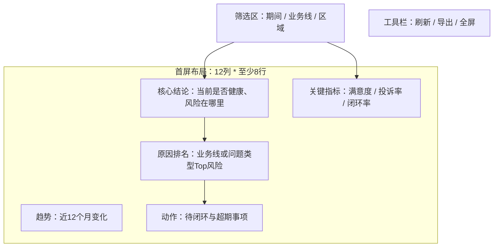

# PRD Output Structure

Use this reference when writing the final PRD. The output must be a development-ready Markdown PRD, not a loose requirement summary.

## Reader-Facing Main Document First

The PRD must have two layers plus a child-PRD bundle:

1. Reader-facing main document: short, visual, and understandable by product, business, and management readers.
2. Development execution appendix: IDs, matrices, `layoutRows`, metric formulas, API fields, workflow execution rows, and validation details.
3. Child PRDs for AI execution: stage-specific appendices/files for 原型、前端、后端、技术方案、测试.

Rules:

- The main document uses readable Chinese names for report type, navigation pages, blocks, metrics, controls, and interactions.
- Raw codes such as `RTP-*`, `PATH-*`, `ESG-*`, `SEV-*`, `ACT-*`, `TRUST-*`, `MEET-*`, `PAGE-*`, `BLK-*`, and `SLOT-*` must not be the primary wording in the main document.
- When an ID must appear in the main document, put it after the readable name or in a final column named `开发引用ID`.
- Every navigation page or page tab must have a Markdown/mermaid preview before the technical layout table.
- Keep the main document focused on the part the reader needs at that step; move exhaustive technical matrices to appendices.
- The main document must include a child PRD registry and final stage map. It must state which child PRD is used by 原型、前端、后端、技术方案、测试, each child PRD's purpose, consumed parent sections, downstream artifact, sync status, and update trigger.
- Child PRDs are allowed to be AI-oriented and ID-heavy; they must still declare parent PRD version, consumed parent sections, sync status, owner workflow, and blocking gaps.

## Appendix ID Rules

Use stable IDs in execution appendices so downstream agents can reference the same objects:

| Object | Prefix | Example |
| --- | --- | --- |
| Page | `PAGE-` | `PAGE-OVERVIEW` |
| Page block | `BLK-` | `BLK-HEALTH-KPI` |
| Component slot | `SLOT-` | `SLOT-HEALTH-KPI-A` |
| Metric | `MET-` | `MET-NPS` |
| Data object | `OBJ-` | `OBJ-EXPERIENCE-MONTHLY` |
| API | `API-` | `API-OVERVIEW-SUMMARY` |
| Interaction | `INT-` | `INT-BIZLINE-SWITCH` |
| Role | `ROLE-` | `ROLE-GROUP-MANAGER` |
| Dynamic conclusion rule | `RULE-` | `RULE-HEALTH-RISK-SUMMARY` |
| Report type implementation path | `RTP-` / `PATH-` | `RTP-KPI-DASHBOARD`, `PATH-DASH-RESULT` |
| Executive satisfaction gate | `ESG-` | `ESG-GROUP-MGMT-DECISION` |
| Priority/severity rule | `SEV-` | `SEV-EXPERIENCE-RISK-HIGH` |
| Action closure item | `ACT-` | `ACT-RISK-CLOSURE-OWNER` |
| Trust/source item | `TRUST-` | `TRUST-NPS-SOURCE-FRESHNESS` |
| Meeting/export item | `MEET-` | `MEET-MONTHLY-REVIEW-EXPORT` |
| Child PRD | `CHILD-PRD-` | `CHILD-PRD-PROTOTYPE` |
| Gap | `GAP-` | `GAP-METRIC-SOURCE-NPS` |

Rules:

- Use the same IDs in all sections.
- Do not leave required fields blank.
- Use `TBD(GAP-*)` when a missing value affects implementation, validation, permission, or delivery.
- Use `none` only when a field is truly not applicable.

## Required PRD Headings

### 0A. PRD 文档包与子 PRD 索引

Follow `child-prd-bundle-contract.md`. This section is part of the reader-facing main PRD and must stay short.

Use this table:

| 阶段 | 使用子 PRD | 子 PRD 作用 | 读取主 PRD 章节 | 下游产物 | 当前同步状态 | 主 PRD 变更后的同步规则 |
| --- | --- | --- | --- | --- | --- | --- |
| 原型 | `CHILD-PRD-PROTOTYPE` | Configure prototype workflow, template layout, blocks, slots, interactions, data-driven conclusions, Template Build Packet seed, and prototype data summary. | 1-13, especially 4A/4B/4C/5/5A/6/7/8/9/13 | Prototype spec/runtime, `docs/template-build-packet.md`, `docs/prototype-data-summary.md` | synced/stale/blocked/not-needed | Update when page, layout, metric, API, interaction, conclusion, scope, or template rules change. |
| 前端 | `CHILD-PRD-FRONTEND` | Configure production frontend route/component/API adapter/state/permission/rendering/runtime QA work. | 1-12 plus prototype output/data summary when available | Frontend function spec, integration tasks, runtime QA | synced/stale/blocked/not-needed | Update when page, component, API, permission, state, formatter, or environment rules change. |
| 后端 | `CHILD-PRD-BACKEND` | Configure data objects, API/service design, metric computation, permission, export, cache, error, and performance behavior. | 1/3/6/7/8/9/10/11 plus prototype data summary when available | API inventory, data model, backend service input | synced/stale/blocked/not-needed | Update when metric, source, field, filter, permission, export, cache, SLA, or API response rules change. |
| 技术方案 | `CHILD-PRD-TECHNICAL-SOLUTION` | Configure architecture, system boundary, technology choices, data flow, NFR, environment, deployment, risk, and milestone plan. | 0-12 plus child PRD status | Technical solution, ADR, implementation plan | synced/stale/blocked/not-needed | Update when scope, architecture boundary, technology stack, data flow, environment, NFR, or risk changes. |
| 测试 | `CHILD-PRD-TESTING` | Configure test cases, integration checks, UI/API/data consistency, permission/export/error tests, evidence, and retest triggers. | 1-12 plus prototype/frontend/backend/API outputs | Test matrix, acceptance checklist, defect evidence | synced/stale/blocked/not-needed | Update when acceptance, interaction, API, permission, data rule, exception state, or delivery scope changes. |

Rules:

- The main PRD explains the child PRD purpose and sync rule; full child PRD details go to section 14 or separate child files.
- Every child PRD must declare parent PRD version and `sync status`.
- If a child PRD is not needed for the current phase, still list it as `not-needed` with a reason.

### 0. 文档元信息

Include:

| Field | Requirement |
| --- | --- |
| 文档名称 | Business report name, not a generic "PRD". |
| 版本 | Use a simple version such as `v0.1`. |
| 状态 | `draft`, `ready-for-review`, or `blocked`. |
| 需求来源 | User request, meeting note, screenshot, existing page, metric list, etc. |
| 适用阶段 | Usually phase-one report development. |
| 主要输出 | PRD, template layout contract, metric matrix, API requirements, interaction rules. |
| 确认事实 | Facts directly supported by input. |
| 推断假设 | Safe assumptions made by the writer. |
| 待确认缺口 | `GAP-*` list. |

### 1. 需求背景与目标

Answer:

- Why build this report/dashboard now.
- Who will use it.
- What management decision, risk, tracking, closure, review, export, or operational problem it solves.
- What success looks like after release.

Use this table:

| Item | Content |
| --- | --- |
| 背景 | Why the current process/data/product is insufficient. |
| 目标用户 | Main users and decision owners. |
| 管理问题 | The concrete problem to solve. |
| 业务目标 | What users can judge, discover, track, export, or close. |
| 成功标准 | Observable outcome or acceptance signal. |

### 2. 用户角色与使用场景

Create a role matrix:

| Role ID | 角色 | 关注内容 | 主要操作 | 权限范围 | 输出/动作 |
| --- | --- | --- | --- | --- | --- |

Common roles include group management, business-line owner, experience/operator, data analyst, system administrator, and auditor/reviewer. Adapt names to the user's domain.

Then create a scene matrix:

| Scene ID | 场景 | 触发时机 | 使用角色 | 关键问题 | 页面入口 | 后续动作 |
| --- | --- | --- | --- | --- | --- | --- |

### 3. 开发范围边界

Use separate tables for in scope, out of scope, and phase split:

| Scope ID | 一期范围 | 说明 | 依赖 | 验收方式 |
| --- | --- | --- | --- | --- |

| Exclusion ID | 本期不做 | 原因 | 后续阶段 |
| --- | --- | --- | --- |

Explicitly decide whether phase one includes or excludes:

- Dashboard display.
- Filters.
- Export.
- Permission/data scope.
- Drilldown/detail.
- Metric口径 display.
- Metric maintenance backend.
- Work order handling.
- Sensitive personal detail.
- Real-time data.
- Mobile adaptation.

Also include the prototype output boundary:

| Output ID | Prototype artifact | Required stack | HTML/static exception authority | Notes |
| --- | --- | --- | --- | --- |
| `ART-PROTOTYPE-RUNTIME` | `vueTemplatePrototype` with `implementationMode: copyTemplateProject` | Copy the selected bundled template project first, then preserve `Vue 3 + TypeScript + Vite + Element Plus + ECharts + axios`; add AntV S2 only for pivot/cross/wide analytical tables | Latest explicit user request for HTML/static/single-file output or exact static preservation; self-developed/non-template exception with rejected copy candidates for `newVue3Project` | PRD sections, attachments, screenshots, copied source, and HTML source files are requirement evidence only; they must not switch downstream workflow output to `htmlPrototype` or default to a blank Vue3 project. |

### 4. 页面内容

Describe page business content before layout. Use:

| Content ID | 页面/导航 | 内容模块 | 业务问题 | 关键指标/维度 | 表现形式 | 角色可见性 |
| --- | --- | --- | --- | --- | --- | --- |

Required content categories for management reports:

- 数据概览.
- 核心结论.
- KPI.
- 趋势.
- 排名.
- 问题类型.
- 闭环情况.
- 业务线专属内容.
- 明细/证据/钻取入口 when needed.
- 导出/复盘内容 when needed.

### 4A. 报表类型实现思路与分块布局映射

Follow `report-type-implementation-patterns.md`. This section must decide how the report should be read before section 5 decides the final page grid and block templates.

If attachments exist, include evidence intake:

| Source ID | Source type | Filename or description | Key facts extracted | Sections affected | Confidence | Gaps raised |
| --- | --- | --- | --- | --- | --- | --- |

If the user supplies a report implementation thought, validate it:

| Idea ID | User-provided report thought | Fit result | Validation dimensions | Recommended adjustment | Reason | User confirmation needed |
| --- | --- | --- | --- | --- | --- | --- |

Choose one primary report-type pattern:

| Pattern selection ID | Primary `RTP-*` pattern | Secondary pattern if mixed | Core management question | Recommended reading path | First viewport priority | Why this is the best path | Downstream workflow |
| --- | --- | --- | --- | --- | --- | --- | --- |

Map the selected reading path to block-layout intent:

| Path step ID | Reading step | Business purpose | Page/Block IDs | First-viewport order | Recommended span | Selected block layout template | Component slot strategy | Dynamic conclusion rule IDs | Interaction IDs | Acceptance note |
| --- | --- | --- | --- | --- | --- | --- | --- | --- | --- | --- |

Rules:

- Use `RTP-*` for the report type pattern and `PATH-*` for reading-path steps.
- The first viewport must implement the first one or two path steps of the selected report type.
- Every visible page block in section 5 must trace to a `PATH-*` row unless it is a support/source/export/permission-only block.
- If the user's proposed thought is optimized or rejected, explain what changed and why the recommended path better serves the role, decision, data grain, and template constraints.
- For dashboards and cockpits, prefer result/status before cause, process, and action.
- For analysis reports, prefer conclusion before evidence, attribution, comparison, and recommendation.
- For detail reports, prefer scope/summary and the authoritative detail table before row trace, validation, and export.
- For risk monitors, prefer risk severity and impacted objects before cause and closure.
- For closure/action boards, prefer task status and overdue pressure before owner progress and review.
- For review/export reports, prefer period conclusion and goal/event evidence before export packaging.
- For self-service analysis, prefer configuration and generated result before interpretation, drilldown, and save/export.

### 4B. 管理层满意度辅助设计

Follow `executive-satisfaction-design-gate.md`. This section is required for management-facing reports and optional only for pure analyst/operator detail queries with no management decision, review, or circulation use.

Create the executive decision profile:

| ESG ID | Role/level | Decision to make | 3-second answer | 30-second cause path | 3-minute action | Decision owner | Evidence needed | Blocker/gap |
| --- | --- | --- | --- | --- | --- | --- | --- | --- |

Create the first-viewport conclusion quality map:

| ESG ID | Conclusion target | Rule ID | Direction | Magnitude | Object/scope | Likely reason | Business impact | Recommended action | Evidence fields | Failure condition |
| --- | --- | --- | --- | --- | --- | --- | --- | --- | --- | --- |

Create the management-vs-technical metric language map:

| ESG ID | Metric ID | Management wording | Technical definition pointer | Formula/owner | Page expression | Detail/tooltip path |
| --- | --- | --- | --- | --- | --- | --- |

Create the priority/severity model when the report has risk, warning, anomaly, overdue, target-miss, exception, or closure content:

| SEV ID | Trigger rule/RULE | Severity | Impact measure | Urgency | Priority sort | Color/non-color cue | Owner/escalation | Empty/conflict rule |
| --- | --- | --- | --- | --- | --- | --- | --- | --- |

Create the action closure model when the report raises problems, risks, tasks, or recommendations:

| ACT ID | Source risk/conclusion | Owner | Due date/SLA | Status | Next action | System entry | Closure evidence | Overdue rule |
| --- | --- | --- | --- | --- | --- | --- | --- | --- |

Create the trust/source model:

| TRUST ID | Data/source item | Source system | Freshness | Coverage/sample | Missing/null policy | Reconciliation/baseline | Permission masking | Source detail route |
| --- | --- | --- | --- | --- | --- | --- | --- | --- |

Create the meeting/review/export model when the report supports review, monthly/quarterly meeting, circulation, or export:

| MEET ID | Scenario | Meeting/review use | Export format | Included conclusion/evidence/action | Filter snapshot | Audience | Audit/watermark |
| --- | --- | --- | --- | --- | --- | --- | --- |

Create the executive satisfaction checklist:

| ESG ID | Check question | Evidence | Pass rule | Gap code |
| --- | --- | --- | --- | --- |

Rules:

- Management-facing dashboards, cockpits, analysis reports, risk monitors, closure boards, and review/export reports must have at least one `ESG-*` row.
- The first viewport must answer the primary management question in 3 seconds; the 30-second cause path and 3-minute action must trace to `PATH-*`, `BLK-*`, `MET-*`, `RULE-*`, `INT-*`, and when relevant `ACT-*` IDs.
- Conclusions must be data-driven through `RULE-*`; section 4B validates conclusion quality but does not replace section 5A rules.
- Section 5 page layout must map `ESG-*`, `SEV-*`, `ACT-*`, `TRUST-*`, and `MEET-*` IDs to blocks, slots, summary areas, interactions, or export behavior.
- For detail reports, section 4B may emphasize query efficiency, row identity, trust/source, export/audit, and row-level action instead of conclusion-first management reading.

### 4C. 导航页与页面预览

This section is mandatory before technical page layout configuration. It shows the actual report structure in a way a reader can understand before seeing `layoutRows`, block IDs, or slot maps.

First show the navigation/page relationship:

Then write one preview per navigation page:

Use a compact readable table after each preview:

| 页面区域 | 展示内容 | 模板使用 | 交互入口 | 说明 |
| --- | --- | --- | --- | --- |
| 筛选区 | 日期、业务线、区域 | 框架模板筛选区 | 切换后刷新全页 | 不自建筛选栏 |
| 核心结论 | 前端按数据生成结论和证据 | 分块布局 + 结论组件内容区模板 | 点击查看证据 | 结论不是固定文案 |

Rules:

- Every retained navigation entry must have one preview.
- The preview must show visible filters, toolbar actions, major blocks, block business content, and important drilldown/jump/modal/drawer/popup entry points.
- The preview uses readable names; raw IDs go to the appendix.
- The preview must reflect the selected report-type implementation path: for example dashboard/cockpit reads conclusion -> cause -> process -> action, while detail reports read summary/scope -> detail table -> row evidence/export.
- If a nav entry does not have enough content, merge it into another page or mark it deferred; do not keep empty navigation.

### 5. 页面布局配置

Follow `template-layout-prd-contract.md`. This section must include:

- Framework template choice.
- Existing shell configuration: title, filters, navigation, toolbar/export, permission entry.
- Reader-facing page preview summary from section 4C before any technical table.
- Page `layoutRows` or equivalent block map, with exact-12-column audit, over-12 rejection, minimum-8-row audit, and block rectangle proof.
- `filterSurfaceMap` and `toolbarActionMap` with visible placement, owner, default state, option/action source, affected blocks, query params, and refresh behavior.
- Block layout template map traced to section 4A `PATH-*` steps and section 4B `ESG-*` / `SEV-*` / `ACT-*` / `TRUST-*` / `MEET-*` IDs when applicable.
- Standard area config for every block.
- `pillAreaConfig` for every block, with configured pill details or `null` plus `notNeededReason`.
- Component slot/component content area template map, including registered ID, standalone Vue file, copy source/target, sample evidence, props/data/state contract, and fallback registration when needed.
- Component content area template index for quick copy lookup.
- `conclusionRuleMap` bindings for any summary-area conclusion, conclusion card, or analysis insight component.
- Layout acceptance notes.

### 5A. Dynamic Conclusion Generation Rules

Summary areas and conclusion cards are not fixed copy. When the page shows a business conclusion, the PRD must define how frontend derives it from current data after filters, date/period switches, metric switches, permission scope, drilldown state, or API refresh.

Use this table:

| Rule ID | Display target | Page/Block/Slot | Area or component template | Input metrics/API fields | Trigger state | Rule logic and threshold | Output fields or sentence template | Evidence fields | Priority/severity | Empty/null/insufficient-data rule | Permission/masking rule | QA case |
| --- | --- | --- | --- | --- | --- | --- | --- | --- | --- | --- | --- | --- |

Rules:

- Use `RULE-*` IDs and reference them from `summaryAreaConfig`, conclusion-card slots, `analysisInsightContract`, metric mounting rows, and the PRD-to-workflow execution matrix.
- `4 summaryArea` may render a dynamic narrative conclusion only when the same block has no conclusion card/component. Its config must include `conclusionRuleId`, input bindings, refresh triggers, and fallback copy.
- Conclusion cards and analysis insight components must compute their visible conclusion from bound data using `conclusionRuleId` or `analysisInsightContract`. Do not put the final generated conclusion sentence into the PRD as fixed copy.
- Static text is allowed only for source, scope, caveat, definition, action-note label, loading, empty, permission-denied, or insufficient-data fallback.
- Rule logic must specify comparison baseline, threshold, ranking/top-N rule, trend direction, priority when multiple rules match, and the evidence fields shown or linked with the conclusion.
- Null and denominator-zero behavior must be compatible with the metric null rules in section 6.

### 6. 指标清单

Follow `metric-api-interaction-matrices.md`. Every displayed metric and every API-returned metric that drives display must have a complete row.

### 7. 指标挂载矩阵

Follow `metric-api-interaction-matrices.md`. Every metric in the display must be mounted to an exact page/block/slot/component/API path.

### 8. 数据与 API 需求

Follow `metric-api-interaction-matrices.md`. Define data objects first, then interfaces.

### 9. 交互逻辑

Follow `metric-api-interaction-matrices.md`. Include both successful response and loading/empty/error/permission behavior.

Required interaction/control tables:

- `filterSurfaceMap`: template filter id, label, control type, option source, default, affected components, query params, permission scope, reset behavior, and state cases.
- `pillAreaConfig`: block id, pill id, label, default active value, affected metric/component/API params, state reset, display position, and response.
- `toolbarActionMap`: action id, label/icon, template toolbar slot, permission, payload, target, and success/failure behavior.
- `interactionBehaviorMap`: trigger, owner, source page/block/slot/template id, target type, payload fields, context inheritance, state sync, close/back behavior, permission rule, and QA case.

### 10. 权限、安全、导出与异常状态

Include when relevant:

| Item ID | 类型 | 规则 | 影响页面/接口 | 验收方式 |
| --- | --- | --- | --- | --- |

Cover:

- Role-based visibility.
- Business-line data scope.
- Sensitive data masking or exclusion.
- Export scope and file fields.
- Empty data.
- Partial data.
- API failure.
- Permission denial.
- Audit/logging if required.

### 11. 验收标准与待确认问题

Use:

| Acceptance ID | 验收项 | 验收标准 | 证据 | 状态 |
| --- | --- | --- | --- | --- |

Use:

| Gap ID | 待确认问题 | 影响范围 | 建议提问对象 | 阻塞等级 |
| --- | --- | --- | --- | --- |

Readiness rules:

- `ready-for-review` requires no blank required cells and no unowned critical gaps.
- `blocked` is required when core metric definitions, permission scope, page count, framework template, or data source cannot be inferred safely.
- `draft` is acceptable when implementation can continue with documented `TBD(GAP-*)` fields.
- The PRD cannot be `ready-for-review` when section 4A lacks attachment intake for provided files, user-thought validation when applicable, one primary `RTP-*` pattern, reading path, first-viewport plan, and path-step-to-block-layout mapping.
- The PRD cannot be `ready-for-review` for a management-facing report when section 4B lacks `ESG-*` decision profile, first-viewport 3-second answer, 30-second cause path, 3-minute action or explicit non-action reason, required `SEV-*` severity, required `ACT-*` closure, `TRUST-*` source/freshness, or required `MEET-*` review/export behavior.
- The PRD cannot be `ready-for-review` when section 4C lacks a Markdown/mermaid preview for every retained navigation page, or when the preview does not show filters, toolbar actions, major blocks, block business content, and interaction entry points.
- The PRD cannot be `ready-for-review` when any `summaryArea`, conclusion card, or analysis insight component displays a business conclusion without a `RULE-*` row and frontend generation rule.
- The PRD cannot be `ready-for-review` when it implies HTML/static prototype generation from PRD wording, attachments, screenshots, copied source, or HTML source samples. Downstream runnable prototype output must stay `vueTemplatePrototype` with the bundled Vue/TypeScript/ECharts stack unless the latest explicit user request is the HTML/static-output authority.
- The PRD cannot be `ready-for-review` when it implies `newVue3Project` as the normal path. Downstream runnable prototype implementation must default to `copyTemplateProject`; a new Vue3 project requires a self-developed/non-template exception, rejected template candidates, owner, and readiness impact.
- The PRD cannot be `ready-for-review` when section 0A child PRD registry is missing, section 14 child PRD bundle is missing, the final stage map does not name the child PRD used by 原型、前端、后端、技术方案、测试, or any affected child PRD is stale after a main PRD change without a `GAP-*` impact note.

### 12. PRD-to-workflow 执行矩阵

Follow `prototype-workflow-execution-map.md`. The PRD must prove that every section is executable by downstream workflow skills.

Use:

| PRD section | Executable IDs | Downstream owner skill/workflow | Execution artifact | Blocking rule | Status |
| --- | --- | --- | --- | --- | --- |

Rules:

- Every PRD section from 0 to 14, including sections 0A, 4A, 4B, 4C, 5A, 13, and 14, must have at least one row.
- Every `PAGE-*`, `BLK-*`, `MET-*`, `API-*`, `INT-*`, `ROLE-*`, `RTP-*`, `PATH-*`, `RULE-*`, `ESG-*`, `SEV-*`, `ACT-*`, `TRUST-*`, `MEET-*`, and `CHILD-PRD-*` that appears in earlier sections must be consumed by at least one execution row.
- `Status` can be `ready`, `draft`, `blocked`, or `deferred-out-of-scope`.
- A prototype workflow can start only when no execution row needed by the first design/layout/template step is `blocked`.
- A prototype workflow can start only when the execution matrix includes the `ART-PROTOTYPE-RUNTIME` row or equivalent output artifact rule, with `vueTemplatePrototype` as the default runnable artifact and a cited latest-user-request exception for any `htmlPrototype`.
- A prototype workflow can start only when the execution matrix declares `implementationMode: copyTemplateProject` by default, or records a bounded `newVue3Project` exception with rejected copy candidates.

### 13. Template Build Packet Seed

Follow `$report-prototype-template-management` `references/template-build-packet-contract.md`. This section is required when the PRD will feed a template-based runnable prototype.

Create a seed that downstream workflows can copy into `docs/template-build-packet.md` after the target project is created:

| Packet section | PRD source | Required seed content | Status |
| --- | --- | --- | --- |
| 0. Packet Status | sections 0, 3 | packet id, source PRD, target template, output artifact, implementation mode | ready/draft/blocked |
| 1. Source Authority | sections 0, 3 | source materials and what they are allowed/not allowed to decide | ready/draft/blocked |
| 2. Framework And Shell | section 5 | framework template, copy source, title, nav/filter/toolbar surfaces, permission scope | ready/draft/blocked |
| 3. Page Registry | sections 4, 4C | every nav/page, page purpose, reader preview ref, first viewport question | ready/draft/blocked |
| 4. Page Layout Rows | section 5 | every page `layoutRows` audit with exact 12 cells and N >= 8 | ready/draft/blocked |
| 5. Block Map | sections 4A, 4B, 5 | block span, selected block layout template, selected Vue file, slot count | ready/draft/blocked |
| 6. Standard Block Areas | section 5 | title/pill/aux/unit/summary configs or null reasons | ready/draft/blocked |
| 7. Component Slot Fills | sections 5, 7 | registered component content area template IDs, standalone Vue files, copy paths, bindings | ready/draft/blocked |
| 8. Data, API, Filters, And Interactions | sections 8, 9 | data/API rows, filter/action maps, interaction behavior rows | ready/draft/blocked |
| 9. Dynamic Conclusion Rules | section 5A | rule rows for summary/conclusion/insight targets | ready/draft/blocked |
| 10. Self-Development Exception Map | sections 3, 5, 9 | only interaction behavior and component content area template exceptions | ready/draft/blocked |
| 11. Implementation File Plan | section 12 | target files and packet sections each file consumes | ready/draft/blocked |
| 12. Validation Plan | sections 11, 12 | ledger, dashboard validation, build, geometry, data summary checks | ready/draft/blocked |

Rules:

- Do not put the full packet in the reader-facing main body.
- The seed must not contain blank required fields. Use `TBD(GAP-*)` for unknown implementation-critical values.
- A template implementation can start only after downstream workflow turns the seed into a current Template Build Packet and marks implementation-critical rows `ready` or `deferred`.

### 14. Child PRD Bundle For Downstream AI Execution

Follow `child-prd-bundle-contract.md`. This section may be split into child files, but the final PRD output must list the files/sections and their sync status.

Use this bundle index:

| Child PRD ID | File/section | Stage | Purpose | Parent sections consumed | Required upstream artifacts | Owner workflow | Sync status | Blocking gaps |
| --- | --- | --- | --- | --- | --- | --- | --- | --- |
| `CHILD-PRD-PROTOTYPE` | Appendix H or `children/prd-child-prototype.md` | 原型 | Template-backed prototype execution | 1-13 | source evidence, section 13 packet seed | prototype workflow | synced/stale/blocked/not-needed | `GAP-*` |
| `CHILD-PRD-FRONTEND` | Appendix I or `children/prd-child-frontend.md` | 前端 | Frontend implementation/integration | 1-12 | prototype output and data summary when available | frontend workflow | synced/stale/blocked/not-needed | `GAP-*` |
| `CHILD-PRD-BACKEND` | Appendix J or `children/prd-child-backend.md` | 后端 | Backend/API/data service execution | 1/3/6/7/8/9/10/11 | metric/API sections and data summary when available | backend workflow | synced/stale/blocked/not-needed | `GAP-*` |
| `CHILD-PRD-TECHNICAL-SOLUTION` | Appendix K or `children/prd-child-technical-solution.md` | 技术方案 | Architecture and implementation plan | 0-12 plus child status | all relevant child statuses | technical solution workflow | synced/stale/blocked/not-needed | `GAP-*` |
| `CHILD-PRD-TESTING` | Appendix L or `children/prd-child-testing.md` | 测试 | Test design and acceptance | 1-12 plus stage outputs | prototype/frontend/backend/API outputs | testing workflow | synced/stale/blocked/not-needed | `GAP-*` |

Then include the final stage map:

| Delivery stage | Must use child PRD | Also read | Cannot start when |
| --- | --- | --- | --- |
| 原型 | `CHILD-PRD-PROTOTYPE` | Main PRD, source evidence, Template Build Packet seed | Child is missing/stale, layout/template rows blocked, or required `RULE-*`/API/interaction rows missing. |
| 前端 | `CHILD-PRD-FRONTEND` | Main PRD, prototype output, `docs/prototype-data-summary.md`, backend/API child when available | Child is missing/stale, API/view model/permission/state contract blocked. |
| 后端 | `CHILD-PRD-BACKEND` | Main PRD, metric dictionary, data/API sections, prototype data summary when available | Child is missing/stale, source/metric/grain/permission/export contract blocked. |
| 技术方案 | `CHILD-PRD-TECHNICAL-SOLUTION` | Main PRD, all child PRD statuses, delivery/version index when available | Child is missing/stale, system boundary or architecture decision blocked. |
| 测试 | `CHILD-PRD-TESTING` | Main PRD, frontend/backend/API outputs, prototype URL/data summary when available | Child is missing/stale, acceptance/API/data/permission/test-data expectation blocked. |

Rules:

- Each child PRD must start with the common child header from `child-prd-bundle-contract.md`.
- The child PRD content must be stage-specific. Do not copy the full main PRD into every child PRD.
- When any parent section changes, update affected child PRDs or mark them `stale` with a `GAP-*`.
- Do not mark the PRD bundle `ready-for-review` unless section 0A and section 14 agree on child PRD IDs, stage purpose, and sync status.
