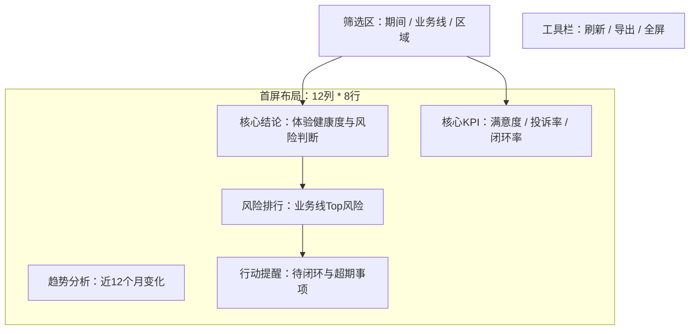

# Readable PRD Main Body

Use this reference before writing the final PRD. The PRD has two layers plus a child-PRD bundle index:

1. Reader-facing main document: short, visual, and business-readable.
2. Development execution appendix: IDs, matrices, template maps, API fields, and validation gates.
3. Child PRD bundle: AI-executable child PRDs for 原型、前端、后端、技术方案、测试.

Do not mix both layers into one long table-heavy document.

## Reader-Facing Rules

- Use plain Chinese section titles and business names in the main document.
- Do not expose raw codes such as `RTP-*`, `PATH-*`, `ESG-*`, `SEV-*`, `ACT-*`, `TRUST-*`, `MEET-*`, `BLK-*`, or `SLOT-*` as the primary wording in the main body.
- When an ID is needed in the main body, put it in a final column named `开发引用ID`, and always pair it with a readable Chinese name.
- Keep the main body focused on: why, who, scope, page content, page preview, metrics, data/API, interactions, and acceptance.
- Put long matrices, machine IDs, slot maps, metric formulas, API field tables, and PRD-to-workflow execution rows in the appendix.
- Every page and navigation tab must have a Markdown preview before the technical layout table.
- The main document must include a child PRD registry that explains which child PRD is used by 原型、前端、后端、技术方案、测试, what each child PRD does, which main PRD sections it consumes, and when it must be updated.
- Child PRDs may be ID-heavy and AI-oriented, but they must declare parent PRD version and sync status.

## Recommended PRD Shape

### 0. 文档信息

Keep this to a compact table: name, version, status, source, facts, assumptions, blockers.

### 0A. 子 PRD 索引与阶段使用说明

This section is required when the PRD will feed more than one downstream stage. Keep it short and human-readable.

| 阶段 | 使用子 PRD | 子 PRD 作用 | 读取主 PRD 章节 | 阶段输出 | 同步规则 |
| --- | --- | --- | --- | --- | --- |
| 原型 | `CHILD-PRD-PROTOTYPE` | 配置原型页面、模板、分块、槽位、交互、动态结论和数据摘要 | 4A/4B/4C/5/5A/6/7/8/9/13 | 原型、Template Build Packet、prototype-data-summary | 主 PRD 页面/布局/指标/API/交互/结论变化时同步 |
| 前端 | `CHILD-PRD-FRONTEND` | 指导前端路由、组件、接口适配、状态、权限和运行 QA | 4C/5/5A/7/8/9/10/11 | 前端功能实现和 QA | 页面/组件/API/权限/状态变化时同步 |
| 后端 | `CHILD-PRD-BACKEND` | 指导 API、数据模型、指标计算、权限、导出和缓存 | 6/7/8/9/10/11 | API/数据服务实现输入 | 指标/数据源/API/筛选/权限变化时同步 |
| 技术方案 | `CHILD-PRD-TECHNICAL-SOLUTION` | 指导架构、技术选型、边界、环境、NFR、风险和实施计划 | 0-12 + 子 PRD 状态 | 技术方案和实施路线 | 范围/架构/环境/NFR/风险变化时同步 |
| 测试 | `CHILD-PRD-TESTING` | 指导测试用例、联调、数据一致性、权限、导出和证据 | 1-12 + 前后端/API/原型产物 | 测试矩阵和验收报告 | 验收/API/交互/权限/异常变化时同步 |

Do not place full child PRD details here. Put them in the child PRD appendices/files.

### 1. 需求背景与目标

Explain why the report exists, who uses it, what management problem it solves, and what success looks like.

### 2. 用户角色与场景

Use one role table and one scenario table. Use business role names, not only role IDs.

### 3. 一期范围边界

Separate:

- 本期做
- 本期不做
- 延后做
- 敏感数据/权限边界

### 4. 报表实现思路

Write the selected report type in natural language:

| 报表类型 | 推荐阅读顺序 | 为什么适合 | 需要校验的点 |
| --- | --- | --- | --- |
| 看板/驾驶舱 | 先看结论 -> 看原因 -> 看过程 -> 看动作 | 管理层需要快速判断健康度和风险 | 首屏是否 3 秒能回答问题 |

If the user supplied a thought, validate it in a short table:

| 用户想法 | 判断 | 优化建议 | 原因 |
| --- | --- | --- | --- |

### 5. 导航页与页面预览

This section is mandatory for any multi-page or nav-based report.

First show the navigation structure:

Then write one preview per navigation page. The preview must show visible filters, toolbar actions, major blocks, and the business content inside each block.

Use this format:

#### 导航页：经营总览

用途：回答当前经营是否健康、主要风险在哪里、下一步看什么。

Then add the block summary:

| 页面区域 | 展示内容 | 使用模板 | 交互 | 说明 |
| --- | --- | --- | --- | --- |
| 筛选区 | 期间、业务线、区域 | 框架模板筛选区 | 切换后刷新全页 | 不自建筛选栏 |
| 核心结论 | 前端按数据生成一句结论和证据 | 分块布局 + 结论组件内容区模板 | 点击看证据 | 结论不是固定文案 |

### 6. 页面布局配置

For each page, keep the reader-facing layout short:

- Framework template: name and reason.
- Page preview: already shown in section 5.
- 12-column grid proof: total rows and row audit summary.
- Block layout choice: readable block name, span, block layout template, reason.
- Standard block areas: title, pill, auxiliary info, unit, component area, summary.

Put the full `layoutRows`, block IDs, slot IDs, and raw template maps in Appendix A.

### 7. 指标与口径

Show only the metrics that users need to understand in the main body. Put complete formulas, denominators, null rules, and data lineage in Appendix B.

### 8. 数据与接口

Explain data objects and API groups at business level first. Put request/response fields in Appendix C.

### 9. 交互逻辑

Use readable user actions:

| 用户操作 | 显示位置 | 系统响应 | 影响范围 | 异常状态 |
| --- | --- | --- | --- | --- |
| 切换业务线 | 筛选区 | 全页指标和结论刷新 | 全部页面块 | 无数据时显示空态 |
| 点击排名 | 排名块 | 打开明细抽屉 | 当前业务线和期间 | 无权限时提示 |

Put `filterSurfaceMap`, `pillAreaConfig`, `toolbarActionMap`, and `interactionBehaviorMap` in Appendix D.

### 10. 验收标准与待确认

Keep acceptance short and testable.

## Execution Appendix

The appendix is required but must not dominate the main document.

Use these appendices:

- Appendix A: Template execution contract, including IDs, `layoutRows`, block layout template map, component slot map, component content area template map.
- Appendix B: Metric dictionary and metric mounting matrix.
- Appendix C: Data object and API field contracts.
- Appendix D: Filter, pill, toolbar, and interaction maps.
- Appendix E: Dynamic conclusion rules.
- Appendix F: PRD-to-workflow execution matrix.
- Appendix G: Template Build Packet seed, using the fixed sections from `$report-prototype-template-management` `references/template-build-packet-contract.md` so downstream implementation can create `docs/template-build-packet.md` without rereading the whole PRD.
- Appendix H: `CHILD-PRD-PROTOTYPE`, the AI-executable prototype PRD.
- Appendix I: `CHILD-PRD-FRONTEND`, the AI-executable frontend PRD.
- Appendix J: `CHILD-PRD-BACKEND`, the AI-executable backend/API PRD.
- Appendix K: `CHILD-PRD-TECHNICAL-SOLUTION`, the AI-executable technical-solution PRD.
- Appendix L: `CHILD-PRD-TESTING`, the AI-executable testing PRD.

## Length Guard

- If the PRD is becoming too long, keep the main body concise and move detail to appendices.
- Do not repeat the same matrix in multiple sections.
- Do not make the reader-facing PRD a wall of IDs.
- The main document must be understandable without reading the appendices.
- The child PRD registry belongs in the main document; child PRD details belong in appendices/files.
