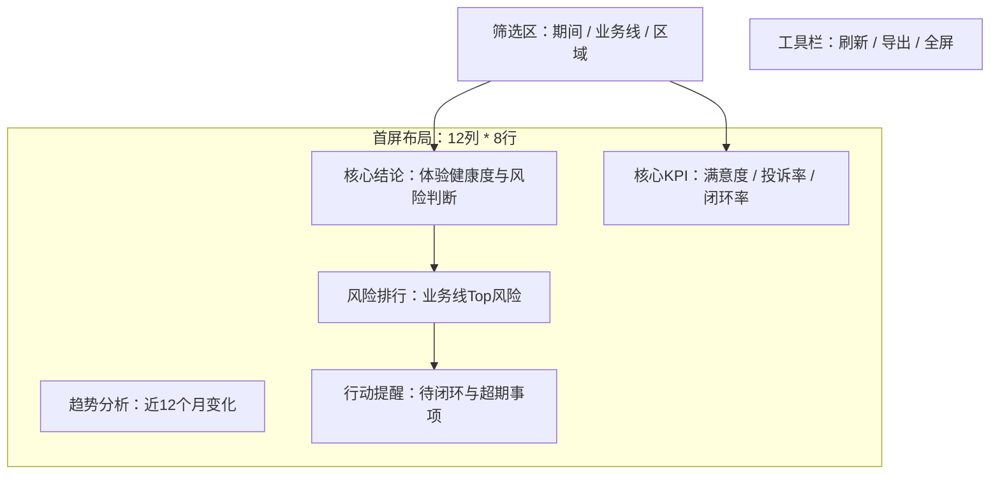

# Readable PRD Main Body

Use this reference before writing the final PRD. The PRD has three layers:

1. Reader-facing main document: short, visual, and business-readable. It is a decision brief, not the execution manual.
2. Development execution files: IDs, matrices, template maps, API fields, and validation gates under `prd/execution/`.
3. Child PRD bundle: AI-executable child PRDs for 原型、前端、后端、技术方案、测试 under `prd/children/`. The main document stays concise, but the final PRD output must still include the full child PRD file bodies.

Do not mix both layers into one long table-heavy document.

## Reader-Facing Rules

- Use plain Chinese section titles and business names in the main document.
- Do not expose raw codes such as `RTP-*`, `PATH-*`, `ESG-*`, `SEV-*`, `ACT-*`, `TRUST-*`, `MEET-*`, `BLK-*`, or `SLOT-*` as the primary wording in the main body.
- When an ID is needed in the main body, put it in a final column named `开发引用ID`, and always pair it with a readable Chinese name.
- Keep the main body focused on: why, who, scope, report implementation thought, page preview, layout summary, metric/data/interaction summary, child PRD routing, and acceptance.
- Put long matrices, machine IDs, slot maps, metric formulas, API field tables, and PRD-to-workflow execution rows in the required files under `prd/execution/`.
- Put all machine-checkable execution detail in execution files or child PRDs. The main body should not contain full `layoutRows`, full metric dictionaries, API field tables, interaction maps, conclusion rule maps, or Template Build Packet sections.
- Every page and navigation tab must have a Markdown preview before the technical layout table.
- The main document must include a child PRD registry that explains which child PRD is used by 原型、前端、后端、技术方案、测试, what each child PRD does, which main PRD sections it consumes, and when it must be updated.
- Child PRDs may be ID-heavy and AI-oriented, but they must declare parent PRD version and sync status.
- Do not confuse the child PRD registry with the child PRDs themselves. The registry belongs in the main document; the child PRD bodies belong only in the five required files under `prd/children/`.

## Recommended Main PRD Shape

The main PRD should stay within these sections. Do not add extra main sections for raw execution tables.

### 0. 文档信息

Keep this to a compact table: name, version, status, source, facts, assumptions, top blockers.

### 0A. 子 PRD 索引与阶段使用说明

This section is required when the PRD will feed more than one downstream stage. Keep it short and human-readable.

| 阶段 | 使用子 PRD | 子 PRD 作用 | 读取内容 | 阶段输出 | 同步规则 |
| --- | --- | --- | --- | --- | --- |
| 原型 | `CHILD-PRD-PROTOTYPE` | 配置原型页面、模板、分块、槽位、交互、动态结论和数据摘要 | 主 PRD 0-8 + `prd/execution/prd-template-execution-contract.md` and `prd/execution/prd-template-build-packet-seed.md` | 原型、Template Build Packet、prototype-data-summary | 主 PRD 页面/布局/指标/API/交互/结论变化时同步 |
| 前端 | `CHILD-PRD-FRONTEND` | 指导前端路由、组件、接口适配、状态、权限和运行 QA | 主 PRD 0-8 + `prd/execution/prd-metric-dictionary-and-mounting.md`, `prd/execution/prd-data-api-contract.md`, `prd/execution/prd-interaction-contract.md`, and `prd/execution/prd-conclusion-rules.md` + 原型输出 | 前端功能实现和 QA | 页面/组件/API/权限/状态变化时同步 |
| 后端 | `CHILD-PRD-BACKEND` | 指导 API、数据模型、指标计算、权限、导出和缓存 | 主 PRD 0/1/3/7/8 + `prd/execution/prd-metric-dictionary-and-mounting.md` and `prd/execution/prd-data-api-contract.md` | API/数据服务实现输入 | 指标/数据源/API/筛选/权限变化时同步 |
| 技术方案 | `CHILD-PRD-TECHNICAL-SOLUTION` | 指导架构、技术选型、边界、环境、NFR、风险和实施计划 | 主 PRD 0-8 + 子 PRD 状态 | 技术方案和实施路线 | 范围/架构/环境/NFR/风险变化时同步 |
| 测试 | `CHILD-PRD-TESTING` | 指导测试用例、联调、数据一致性、权限、导出和证据 | 主 PRD 0-8 + `prd/execution/prd-metric-dictionary-and-mounting.md`, `prd/execution/prd-data-api-contract.md`, `prd/execution/prd-interaction-contract.md`, and `prd/execution/prd-conclusion-rules.md` + 前后端/API/原型产物 | 测试矩阵和验收报告 | 验收/API/交互/权限/异常变化时同步 |

Do not place full child PRD details here. Put them in the required child PRD files under `prd/children/`.

### 1. 需求背景与目标

Explain why the report exists, who uses it, what management problem it solves, and what success looks like.

### 2. 用户角色与场景

Use one role table and one scenario table. Use business role names, not only role IDs.

### 3. 一期范围边界

Separate:

- 本期做
- 本期不做
- 延后做
- 敏感数据/权限边界

### 4. 报表实现思路

Write the selected report type in natural language:

| 报表类型 | 推荐阅读顺序 | 为什么适合 | 需要校验的点 |
| --- | --- | --- | --- |
| 看板/驾驶舱 | 先看结论 -> 看原因 -> 看过程 -> 看动作 | 管理层需要快速判断健康度和风险 | 首屏是否 3 秒能回答问题 |

If the user supplied a thought, validate it in a short table:

| 用户想法 | 判断 | 优化建议 | 原因 |
| --- | --- | --- | --- |

### 5. 导航页与页面预览

This section is mandatory for any multi-page or nav-based report.

First show the navigation structure:

Then write one preview per navigation page. The preview must show visible filters, toolbar actions, major blocks, and the business content inside each block.

Use this format:

#### 导航页：经营总览

用途：回答当前经营是否健康、主要风险在哪里、下一步看什么。

Then add the block summary:

| 页面区域 | 展示内容 | 使用模板 | 交互 | 说明 |
| --- | --- | --- | --- | --- |
| 筛选区 | 期间、业务线、区域 | 框架模板筛选区 | 切换后刷新全页 | 不自建筛选栏 |
| 核心结论 | 前端按数据生成一句结论和证据 | 分块布局 + 结论组件示例 | 点击看证据 | 结论不是固定文案 |

### 6. 模板布局摘要

For each page, keep the reader-facing layout short. This section tells people what will be built; it does not carry the machine implementation tables.

- Framework template: name and reason.
- Page preview: already shown in section 5.
- Layout section decomposition: show how the page is split into `12*K` parts, such as `12*3 + 12*3 + 12*3`, and what each part is for.
- 12-column grid summary: total rows, every visible top-level block row span `N >= 3`, and whether the audit is ready/draft/blocked.
- Layout coordinate explanation: mention `R-B` for a block and `R-B-S` for a component slot, with one example only.
- Block area choice: readable block name, span, `createBlockAreaConfig` config, slot count, slot pattern such as `AB` / `AAB` / `AABBCC`, and reason. Retired fixed-wrapper evidence may be noted only as migration context or a gap, not as the ready implementation.
- Standard block areas: title, pill, auxiliary info, unit, component area, summary.

Put the full `layoutRows`, `layoutCoordinateMap`, block IDs, slot IDs, and raw template maps in `prd/execution/prd-template-execution-contract.md`.

### 7. 指标、数据与交互摘要

Use one compact summary table for the core business metrics, data/API groups, and user operations. This section helps readers understand the report behavior; it is not the implementation contract.

Recommended columns:

| 主题 | 主体内容 | 页面/位置 | 数据或规则来源 | 子 PRD 负责方 |
| --- | --- | --- | --- | --- |
| 核心指标 | 关键指标名称、业务含义、方向 | 哪些页面/模块展示 | `prd/execution/prd-metric-dictionary-and-mounting.md` / 后端子 PRD | 原型、前端、后端、测试 |
| 数据/API | API 分组和数据域 | 哪些页面调用 | `prd/execution/prd-data-api-contract.md` / 后端子 PRD | 前端、后端、技术方案、测试 |
| 交互 | 筛选、胶囊、排名点击、下钻、跳转、弹窗、导出 | 显示位置和影响范围 | `prd/execution/prd-interaction-contract.md` / 原型和前端子 PRD | 原型、前端、测试 |
| 动态结论 | 结论卡/说明区根据数据生成 | 目标块或组件 | `prd/execution/prd-conclusion-rules.md` / 原型和前端子 PRD | 原型、前端、测试 |

For interaction examples, keep only readable user actions:

| 用户操作 | 显示位置 | 系统响应 | 影响范围 | 异常状态 |
| --- | --- | --- | --- | --- |
| 切换业务线 | 筛选区 | 全页指标和结论刷新 | 全部页面块 | 无数据时显示空态 |
| 点击排名 | 排名块 | 打开明细抽屉 | 当前业务线和期间 | 无权限时提示 |

Put complete metric口径 in `prd/execution/prd-metric-dictionary-and-mounting.md`, request/response fields in `prd/execution/prd-data-api-contract.md`, `filterSurfaceMap`, `pillAreaConfig`, `toolbarActionMap`, and `interactionBehaviorMap` in `prd/execution/prd-interaction-contract.md`, and full `conclusionRuleMap` in `prd/execution/prd-conclusion-rules.md`.

### 8. 验收标准与待确认

Keep acceptance short and testable.

## Required Execution Files

The execution files are required but must not be merged into the main document.

Use these files:

- `prd/execution/prd-template-execution-contract.md`: Template execution contract, including `templateAssetUnderstandingMap`, IDs, `layoutSectionMap`, `layoutRows`, `layoutCoordinateMap`, block area config map with direct template availability and slot count/pattern, component slot map with visual-type size compatibility, and registered component example map.
- `prd/execution/prd-metric-dictionary-and-mounting.md`: Metric dictionary and metric mounting matrix.
- `prd/execution/prd-data-api-contract.md`: Data object and API field contracts.
- `prd/execution/prd-interaction-contract.md`: Filter, pill, toolbar, and interaction maps.
- `prd/execution/prd-conclusion-rules.md`: Dynamic conclusion rules.
- `prd/execution/prd-workflow-execution-matrix.md`: PRD-to-workflow execution matrix.
- `prd/execution/prd-template-build-packet-seed.md`: Template Build Packet seed, using the fixed sections from `report-prototype-template-management` `references/template-build-packet-contract.md` so downstream implementation can create `docs/template-build-packet.md` without rereading the whole PRD.
- `prd/children/prd-child-prototype.md`: `CHILD-PRD-PROTOTYPE`, the required AI-executable prototype PRD. This is where detailed template/layout/slot/component execution rules live.
- `prd/children/prd-child-frontend.md`: `CHILD-PRD-FRONTEND`, conditional AI-executable frontend PRD when frontend integration is in scope.
- `prd/children/prd-child-backend.md`: `CHILD-PRD-BACKEND`, conditional AI-executable backend/API PRD when backend/API implementation is in scope.
- `prd/children/prd-child-technical-solution.md`: `CHILD-PRD-TECHNICAL-SOLUTION`, conditional AI-executable technical-solution PRD when architecture/implementation planning is in scope.
- `prd/children/prd-child-testing.md`: `CHILD-PRD-TESTING`, conditional AI-executable testing PRD when formal test handoff is in scope.

`prd-child-prototype.md` is mandatory for report-development PRDs. Do not end the PRD bundle at `prd/execution/prd-template-build-packet-seed.md`; generate additional child PRDs only for in-scope downstream work.

## Length Guard

- If the PRD is becoming too long, keep the main body concise and move detail to execution files or child PRDs.
- Do not repeat the same matrix in multiple sections.
- Do not make the reader-facing PRD a wall of IDs.
- The main document must be understandable without reading the execution files or child PRDs.
- The main document should not grow just because an implementation detail is mandatory. Mandatory implementation detail goes to execution files or child PRDs.
- The child PRD registry belongs in the main document; child PRD details belong in `prd/children/`.
- Length pressure is not a reason to omit the required prototype child PRD or any in-scope conditional child PRD. When space is tight, keep each child PRD concise but include its header, consumed parent sections, execution inputs, blockers, sync status, and downstream start gate.
